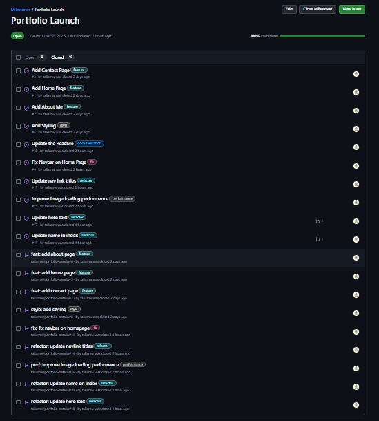
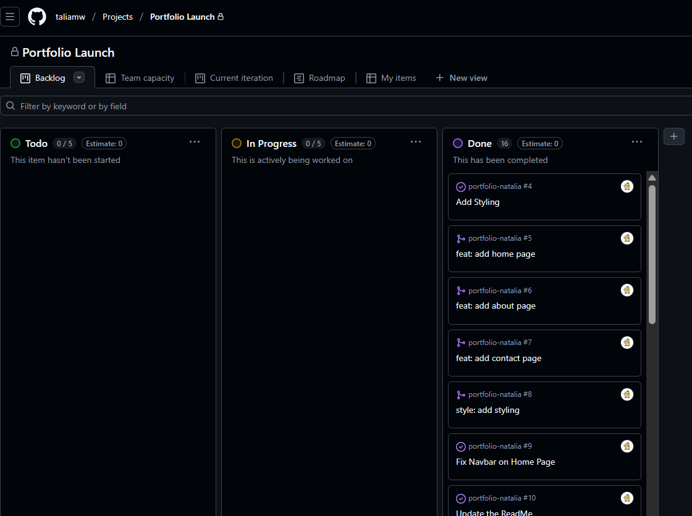
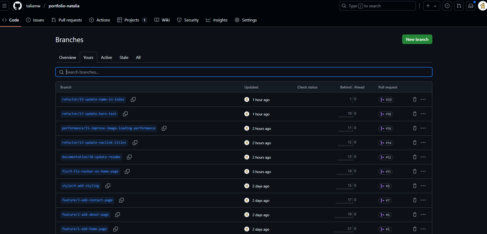
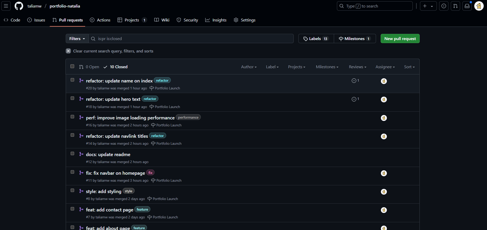
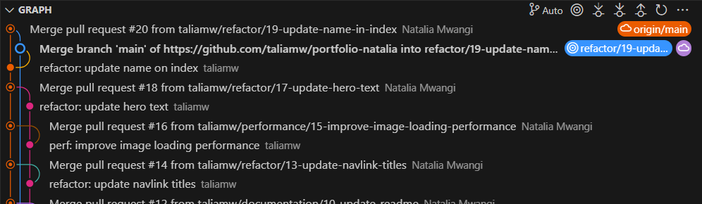

# Personal Portfolio Documentation

## 1. Student Details

- **Full Name**: Natalia Mary Wambui Mwangi
- **Admission Number**: 150473
- **GitHub Username**: taliamw
- **Email**: natalia.mwangi@strathmore.edu

## 2. Deployed Portfolio Link

- **GitHub Pages URL**:  
  (https://taliamw.github.io/portfolio-natalia/)

## 3. Learnings from the Git Crash Program

**🧠 What I Thought I'd Learn vs What I Actually Learned**
**1. Concept: Using Github for collaboration**

`Expectation`
I expected GitHub to just be a place to put my code so I could get a link.

`Reality` 
There’s so much more things such as branches, pull requests, previewing code, deploying with GitHub Pages. It's has a lot of collaborative tools useful for developers.

`Impact`
I deployed my portfolio straight from GitHub. Seeing my changes go live with just a push felt real. Now I feel like I actually own my work.

**2. Concept: Pull Requests (PRs)**
`Expectation`
I thought pull requests were only necessary for team collaborations with formal review processes.

`Reality` 
PRs are useful even when working alone. They provide a structured way to review changes before merging, encourage cleaner code, and help keep the main branch stable.

`Impact`
I began using pull requests for all major changes in my portfolio. It helped me review updates critically and maintain a clear record of progress over time.

**3. Concept: Merge Conflicts**  
`Expectation`  
I assumed merge conflicts were something only big teams dealt with, and that they’d be extremely difficult to resolve.

`Reality`  
Merge conflicts can happen even in solo projects when changes are made on the same lines across different branches. Git provides clear markers and tools to resolve them manually.

`Impact`  
Understanding merge conflicts gave me confidence to work with multiple branches. Now, instead of fearing conflicts, I see them as part of the development process.

**4. Concept: Branching**  
`Expectation`  
I thought branches were overkill for simple personal projects and only mattered in complex, team-based development.

`Reality`  
Branches are incredibly useful for organizing changes, experimenting with new features, and avoiding accidental breakages—even when working alone.

`Impact`  
Creating feature-specific branches helped me test different designs for my portfolio without interfering with the live version. It made my workflow cleaner and more focused.


## 4. Screenshots of Key GitHub Features

Include screenshots that demonstrate how you used GitHub to manage your project. For each screenshot, write a short caption explaining what it shows.

> Upload the screenshots to your GitHub repository and reference them here using Markdown image syntax:
> (you could just simply copy and paste the image into the Assignment.md)

```markdown

```

### A. Milestones and Issues

- Screenshot showing your milestone(s) and the issues linked to it.


### B. Project Board

- Screenshot of your GitHub Project Board with issues organized into columns (e.g., To Do, In Progress, Done).


### C. Branching

- Screenshot showing your branch list with meaningful naming.


### D. Pull Requests

- Screenshot of a pull request that’s either open or merged and linked to a related issue.


### E. Merge Conflict Resolution

- Screenshot of a resolved merge conflict (in a pull request, commit history, or your local terminal/GitHub Desktop).

